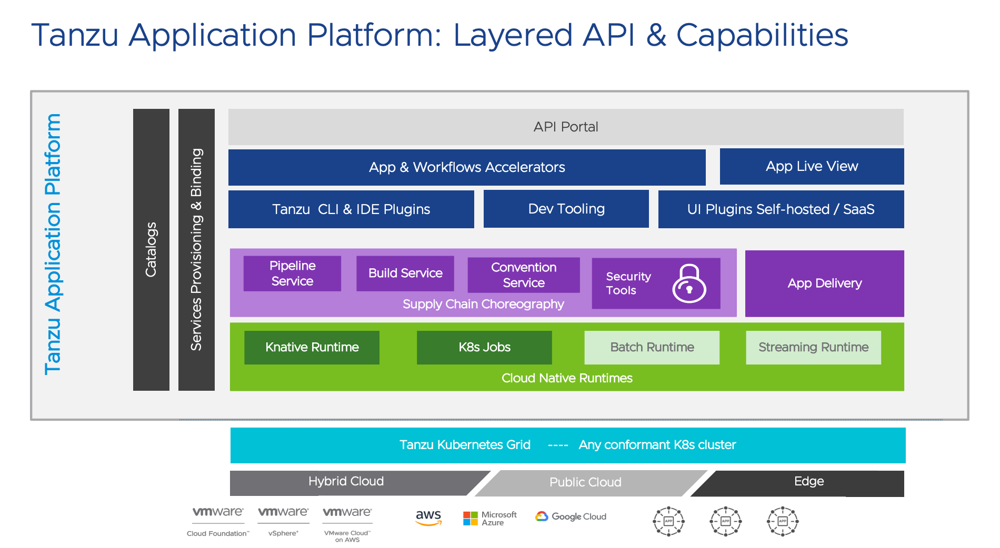

# Tanzu Application Platform Architecture

The architecture of the Tanzu Application Platform is complex and does chance from time to time as new features are added. The best way to keep up to date is to follow the [Tanzu Application Platform Documentation](https://docs.vmware.com/en/VMware-Tanzu-Application-Platform/index.html).

A high level system overview looks something like that shown in this diagram taken from the documentation.

