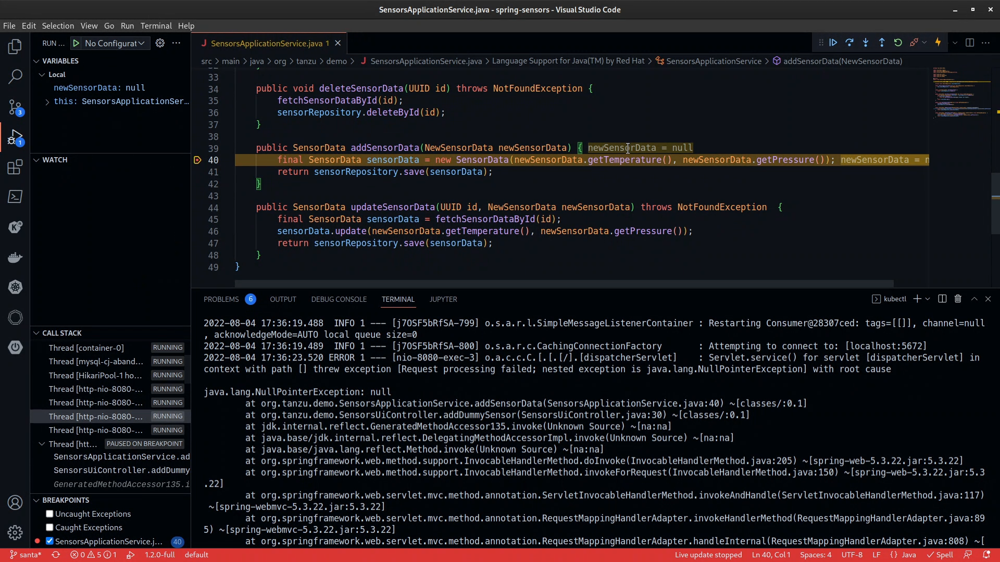
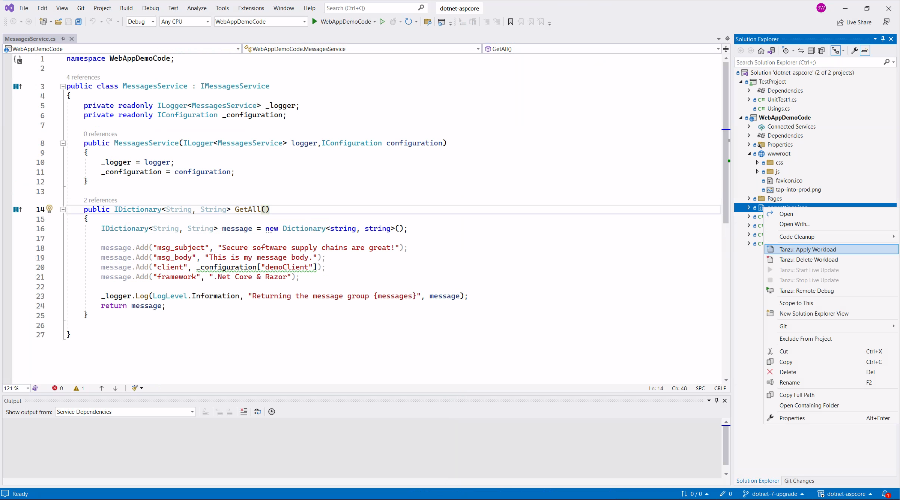

# Tanzu IDE Plugins

The Tanzu Application Platform includes plugins for many popular Integrated Development Environments (IDEs). These plugins can help you begin new projects, deploy and debug code, and provide a permanent link to the status of your apps running on the platform.

Look out for these features and more in your IDE:

* Apply and delete workloads on Tanzu Application Platform
* Live update code as it's running on the platform
* Live debug code while it's running on the platform
* Bootstrap new projects quickly with Application Accelerators
* View live information about your running workloads

## JetBrains IntelliJ IDEA 

Popular Java IDE created by JetBrains.

## Microsoft Visual Studio (VS) Code

Popular Multi-language IDE created by Microsoft.

## Microsoft Visual Studio

Popular .Net IDE created by Microsoft.

## Plugin Documentation

The installation instructions for the plugins vary by IDE and operating system. You'll find all the details in the [Tanzu Application Platform Documentation](https://docs.vmware.com/en/VMware-Tanzu-Application-Platform/index.html).

## Plugin Downloads

You can download the plugin for your IDE and operating system from [TanzuNet](https://network.tanzu.vmware.com/products/tanzu-application-platform/).