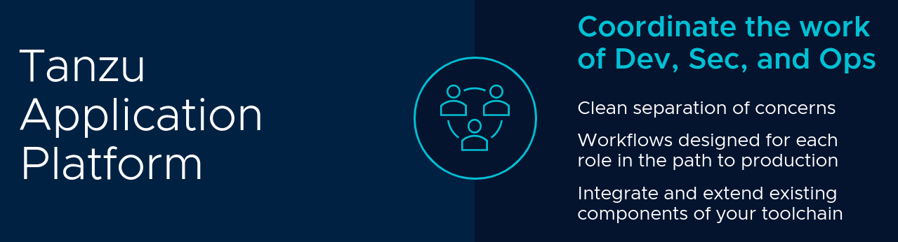

Tanzu Application Platform (TAP) is a modular, application-aware platform that runs on any compliant public cloud or on-premises Kubernetes cluster. It delivers a superior multi-cloud developer experience with a prepaved path to production including all the needed components preconfigured for developer teams to build and deploy software quickly and securely. It’s a composable platform that teams can customize based on their organization’s preferences and changing business needs.

## Why Choose Tanzu Application Platform?

There are many reasons why Tanzu Application Platform is the right choice for your teams.

### 1. Keep developers happy

Happiness and productivity go hand-in-hand. Tanzu Application Platform is designed support developers by taking away the toil of dealing with infrastructure. Running applications on Kubernetes becomes much simpler and less error prone. 

Tanzu Application Platform makes coding easier and more fun with several developer-focussed features. 

* [Application Accelerators](accelerators.md) allow rapid bootstrapping of new coding projects and provide a marketplace where developers can share their expertise as patterns. 

* [Tanzu IDE plugins](ide-plugins.md) support live debugging and code editing and provide a window on the status of your applications that are already running on the platform.

* [Tanzu Developer Portal](tanzu-developer-portal.md) makes API discovery simpler and offers LiveView for second by second insights on your running applications.

### 2. Bring your own opinions

Tanzu Application Platform allows you to automate application deployment using a built-in suite of tools. These tools form a secure software supply chain that includes a build system that compiles and tests your application, security measures such as vulnerability scanning and software bill of materials (SBOM), and container image creation and storage in common registries. Best of all, you can customize these supply chains to fit your particular needs by extending the task chain or integrating your preferred tools. 

### 3. Accelerate your path to production

Establish a clear separation of concerns between developers and operators so that everyone benefits. With Tanzu Application platform you'll notice a much more seamless handoffs from source code on a laptop to apps running live in production - without compromising on security.

## What To Expect From Tanzu Application Platform

Tanzu Application Platform has many features and capabilities. Here are some of the outcomes you can expect...

* **Enhanced developer productivity and user experience.**  
Unlock greater developer productivity with a Kubernetes abstraction layer enabling faster, more secure applications from the design stage all the way through to development and delivery.

* **Jumpstart your application development.**  
Use pre-configured cloud native pattern templates to bootstrap new applications.

* **Boost your developer velocity.**  
Get a consistent GUI to bring services and APIs together in one management portal.

* **Accelerate your path to production.**  
Secure software supply chains automate out-of-the-box app deployment.

* **Runs on Kubernetes, either in the cloud or on-premise.**  
Tanzu Application Platform supports a multi-cloud environment and runs on any API-conformant Kubernetes distribution.

* **A Flexible, composable platform that you control.**  
Supply Chain Choreographer brings pre-approved paths to production with security and compliance baked in. The supply chains are modular so teams can easily change the supply chain to meet their business needs or integrate their favorite tools.

## Watch Tanzu Application Platform In Action

In this short video you'll experience the power of the Tanzu Application Platform's secure supply chain feature. In this video we cover Spring Boot (Java), but there are many more language options available including Python, .Net, Node.js, and more.

