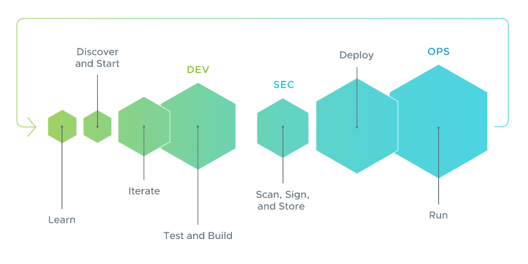

# Introduction - Tanzu Application Platform

**Faster, more secure paths to production!**

Tanzu Application Platform (TAP) is a modular, application-aware platform that runs on any compliant public cloud or on-premises Kubernetes cluster. It delivers a superior multi-cloud developer experience with a prepaved path to production including all the needed components preconfigured for developer teams to build and deploy software quickly and securely. It’s a composable platform that teams can customize based on their organization’s preferences and changing business needs.

## Make your developers happy

Enable developers to quickly get started with pre-configured templates for cloud native patterns.

## Bring your own opinions

Automate app deployment with a built-in secure software supply chain you can customize.

## Accelerate your path to production

Establish a clear separation of concerns between developers and operators for seamless app handoffs from source code to running apps in production.

## What To Expect From Tanzu Application Platform

Tanzu Application Platform has many features and capabilities. Here are some of the outcomes you can expect...

* **Enhanced developer productivity and user experience.**  
Unlock greater developer productivity with a Kubernetes abstraction layer enabling faster, more secure applications from the design stage all the way through to development and delivery.

* **Jumpstart your application development.**  
Use pre-configured cloud native pattern templates to bootstrap new applications.

* **Boost your developer velocity.**  
Get a consistent GUI to bring services and APIs together in one management portal.

* **Accelerate your path to production.**  
Secure software supply chains automate out-of-the-box app deployment.

* **Runs on Kubernetes, either in the cloud or on-premise.**  
Tanzu Application Platform supports a multi-cloud environment and runs on any API-conformant Kubernetes distribution.

* **A Flexible, composable platform that you control.**  
Supply Chain Choreographer brings pre-approved paths to production with security and compliance baked in. The supply chains are modular so teams can easily change the supply chain to meet their business needs or integrate their favorite tools.