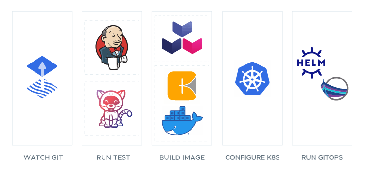

# Overview - Tanzu Application Platform

Tanzu Application Platform has many features and capabilities. Here are some of the outcomes you can expect...

**Enhances your developer productivity and user experience.**

Unlock developer productivity with a Kubernetes abstraction layer enabling faster, more secure app design, development, and delivery.

**Jumpstarts your app development.**

Use preconfigured cloud native pattern templates to bootstrap new applications.

**Boosts your developer velocity.** 

Get a consistent GUI to bring services and APIs together in one management portal.

**Accelerates the path to production.**

Secure software supply chains automate out-of-the-box app deployment.

**Runs on Kubernetes - In The Cloud Or On-premises.**

Tanzu Application Platform supports a multi-cloud environment and runs on any API-conformant Kubernetes distribution.

**A Flexible, composable platform that you control.**

Use Supply Chain Choreographer to create pre-approved paths to production with security and compliance baked in. The platform is modular so teams can easily change the supply chain to meet their business needs. Customize the supply chain to use your favorite tools or pre-built container images.

