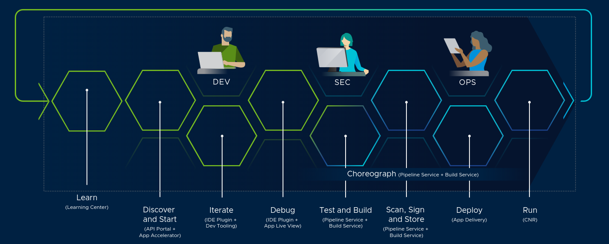

# Use Cases

There are lots of scenarios in which you'll find Tanzu Application Platform to be useful in your daily work. The diagram below illustrates just a few of them.

## 1. Learning

Even before the process of delivering code has begun, Tanzu Application platform can help you deliver learning workshops that train your teams and prepare them for the many task ahead. The [Tanzu Learning Center](learning-centers.md) allows you to create, publish, and consume learning workshops on any topic with a rich "hands-on" experience.

## 2. Discovery

Understanding the environment you're working in is critical to your continued success. [Tanzu Developer Portal](tanzu-developer-portal.md) provides insights and context about the applications around you, including their architectural structure and their programmable APIs.

## 3. Coding

[Application Accelerators](accelerators.md) ease the process of starting new projects. These pre-approved templates can be created by your organisation and contain all your preferred libraries and best practices so that evryone can set off on the right foot. While working on your applications, Live Debug and Live Update let you troubleshoot and manipulate your code live from inside your IDE - while it's running on the platform. 

## 4. Test & Build

With Tanzu Application Platform's secure software supply chain, there's no need for every team to create and maintain their own unique build pipeline (unless you really want to!?). Application source code can be sent straight to the platform where it is built, tested, and containerized ready for deployment.

[Buildpacks](https://buildpacks.io) provide some of the magic. They  allow the Tanzu Application Platform to build source code a wide variety of programming languages out-of-the-box including Java, .Net, Node.JS, Python, Golang, and more.

## 5. Sign, Scan And Store

Every application built by the secure software supply chain has it's contents scanned for known vulnerabilities and it's container signed for added traceability. These results are then stored in a Software Bill Of Materials (or SBOM) to help with auditing.

## 6. Deploy

The Tanzu Application Platform can deploy applications for you, straight to Kubernetes with no YAML required! Sevices, batch applications, and serverless apps.

## 7. Run

The Tanzu Application platform can take care of running your application container image and arranging for proper ingress so that your users can access your applications.

Furthermore, features like Application Single Sign-On and Spring API Gateway allow for fine grained access control and traffic management. 
