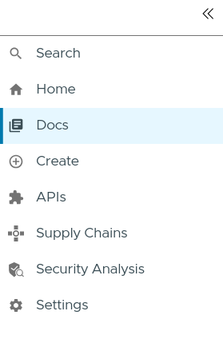
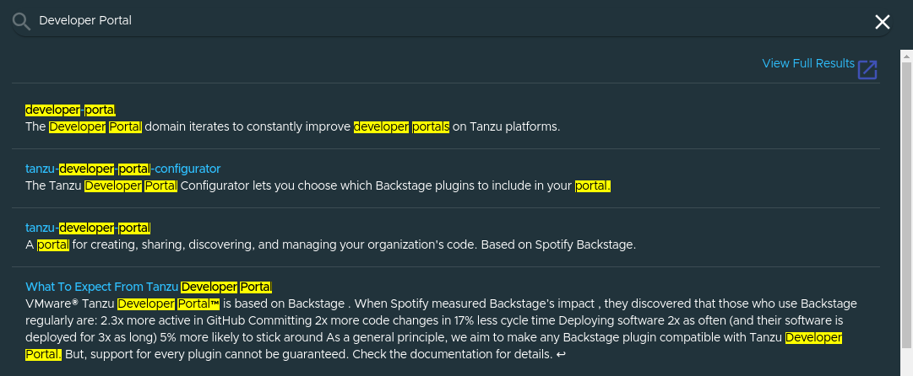
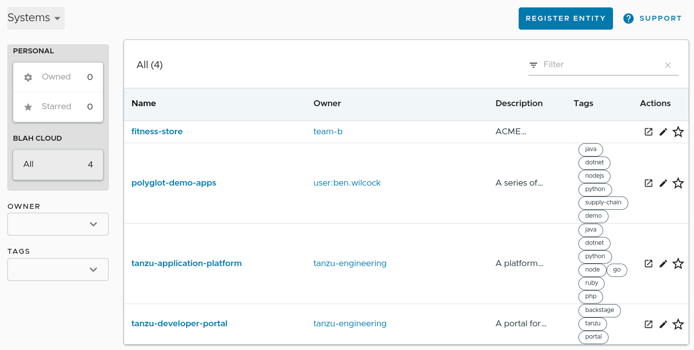
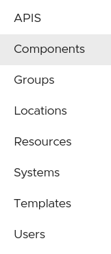
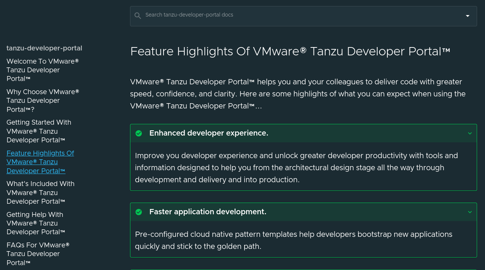
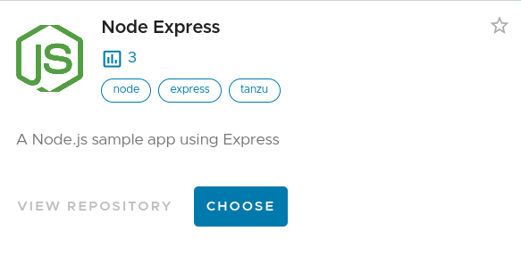
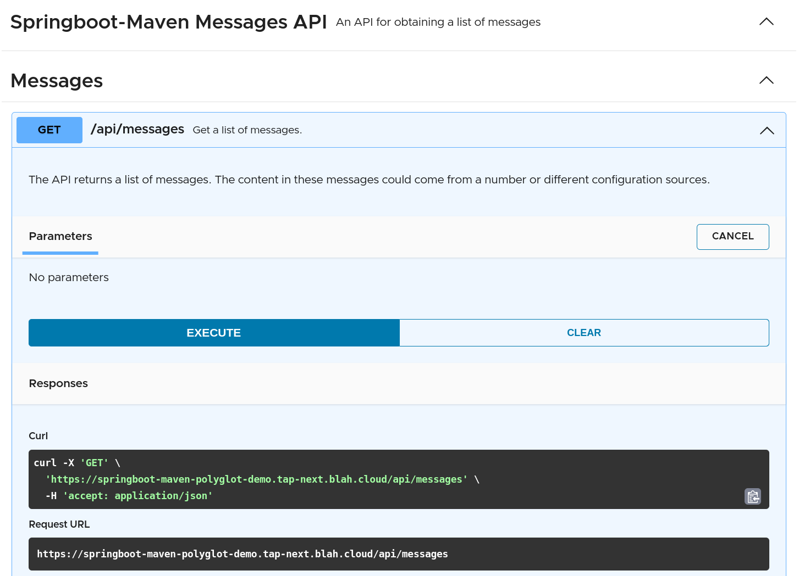
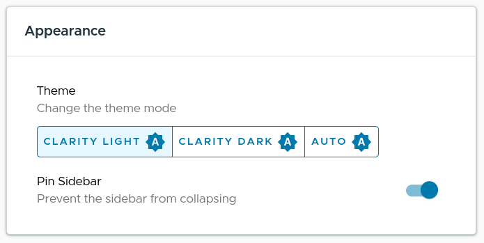

# Getting Started With VMware® Tanzu Developer Portal™

The VMware® Tanzu Developer Portal™ provides your teams with a single place where they can create, document, observe, and manage the enterprise applications they care for. Here are some quick tips to get you started with the VMware® Tanzu Developer Portal™.

??? tip "Navigating VMware® Tanzu Developer Portal™"
    Over on the far left of your screen there is a vertical side panel of icons. These icons allow you to navigate your way around the different features of the VMware® Tanzu Developer Portal™. This panel can be expanded or contracted by clicking on the chevrons at the top. 

    <figure markdown>
    { width="250" }
    <figcaption>The main menu bar.</figcaption>
    </figure>

    **Search** is where you can enter queries and search for items.

    **Home** is where you'll find the software catalog.

    **Docs** contains links to all the technical documentation (TechDocs) registered with the portal.

    **Create** provides multiple application accelerators (code templates) for new projects.

    **APIs** details the application programming interfaces registered with the portal.

    **Supply Chains** are how platforms can deliver code securely to production. They include steps to build and test your code for known vulnerabilities, and take care of details such as deployment.[^1]

    **Security Analysis** is a dashboard where and vulnerabilities discovered in your software by the supply chain can be assessed, explored, and managed.[^1]

    **Settings** lets you customize your portal experience with settings for "Dark Mode" etc.

Expand each of the sections below for more information about each menu item.

??? tip "**Search – Find What You Need**"
    The VMware® Tanzu Developer Portal™ includes a comprehensive search facility that can help you to find information stored in the system. Your technical documentation, APIs, software catalog entries, application accelerators, and more are all indexed by the search system.

    <figure markdown>
        
        <figcaption>An example of a search for items that relate to the to the search term "Developer Portal"</figcaption>
    </figure>

??? tip "**Home – Discover Your Software Catalog**"

    The VMware® Tanzu Developer Portal™'s software catalog (labelled as 'Home' in the navigation panel) offers deep contextual awareness of what components are available, the APIs and documentation for them, and the critical details of who owns each piece.

    <figure markdown>
        
        <figcaption>The software catalog can list systems, components, users, and more.</figcaption>
    </figure>

    You can filter the catalog by category (Components, APIs, Systems, Users, etc.) or by owner, lifecycle, tags, etc.

    <figure markdown>
        { height="200" }
        <figcaption>Using the category filter can help you focus on only the resources you're looking for.</figcaption>
    </figure>

??? tip "**Docs – Browse Your Technical Documentation**"

    Applications (components, systems, etc.) can host their technical documentation in the portal.  Once shared, information access and retrieval becomes easier for all your development teams. These essential technical documents are easy to write, searchable, and can even live alongside your code in version control (if that's your preferred location). No more searching the wiki, hunting down word documents, or wasting precious time on out of date docs! 

    <figure markdown>
        
        <figcaption>TechDocs help you share rich documentation with others in your organization.</figcaption>
    </figure>

??? tip "**Create – Start A New Project**"

    Application Accelerators (labelled as 'Create' in the navigation menu) provide ready made, pre-approved coding templates which developers can browse, customize, and download. These templates reduce the time required to onboard new developers or begin new coding projects. They also encourage the use of your best practices and help your developers stay on the [golden path](https://youtu.be/k1RNWF1Nblc).

    <figure markdown>
        
        <figcaption>Using a Node.JS accelerator to begin a new project.</figcaption>
    </figure>
    

    Best of all, you can [create your own Application Accelerator](https://docs.vmware.com/en/VMware-Tanzu-Application-Platform/1.5/tap/getting-started-create-app-accelerator.html "create your own Application Accelerator") templates and share them with other developers. This helps you standardize your practices, foster the use of preferred tools, and eliminate the time you normally waste adding the same common libraries and configuration settings to each project.

??? tip "**APIs – Know Your Application Programming Interfaces**"

    APIs available to developers can be listed, shared, and documented using common standards such as OpenAPI[^2]. APIs registered in this way have a high degree of utility and visibility. With the API document view, you can "try out" an API in the portal without writing any code. 

    <figure markdown>
        
        <figcaption>Trying out an API in the API docs viewer.</figcaption>
    </figure>

??? tip "**Settings – Customize Your Experience**"

    The settings panel is where you will find access to the "light" and "dark" modes for the UI as well as other information such as your profile details (if you have a profile).

    <figure markdown>
        
        <figcaption>Use the settings panel to change your UI theme.</figcaption>
    </figure>

[^1]: Included as part of VMware® Tanzu Application Platform™ and available in VMware® Tanzu Developer Portal™ for evaluation purposes.
[^2]: Some may know the OpenAPI specification via its previous name - "Swagger documentation." 

*[UI]: User Interface
*[API]: Application Programming Interface
*[APIs]: Application Programming Interfaces