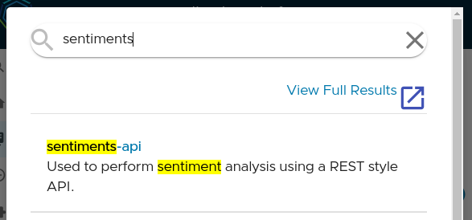

# Getting Started With VMware® Tanzu Developer Portal™

The VMware® Tanzu Developer Portal™ provides your teams with a one place where they can create, document, observe, and manage the enterprise applications they care for. Here are some quick tips to get you started with the VMware® Tanzu Developer Portal™.

## Navigating the UI

Over on the left you'll find a side panel where you can navigate around the different features of the portal. This panel can be expanded (:fast_forward:) and contracted (:rewind:) by clicking on the chevrons at the top.  

* [**Search**](#search-find-what-you-need) is where you can enter queries and search for items.
* [**Home**](#home-discover-your-software-catalog) is where you'll find the software catalog.
* :page: [**Docs**](#docs-browse-your-technical-documentation) contains links to all the technical documentation (TechDocs) registered with the portal.
* [**Create**](#create-start-a-new-project) provides multiple application accelerators (code templates) for new projects.
* [**APIs**](#apis-locate-your-apis) details the application programming interfaces registered with the portal.
* **Supply Chains** are how Tanzu Application Platform delivers code securely to production (included for evaluation purposes)
* **Security Analysis** is a dashboard where Tanzu Application Platform can highlight application vulnerabilities (included for evaluation purposes)
* [**Settings**](#settings-customize-your-experience) lets you customize your portal experience.

## Search: Find What You Need

The Tanzu Developer Portal includes a system wide search facility that can help you find information stored within the system. Your [technical documentation](#browse-your-technical-documentation), [API's](#locate-your-apis), [software catalog entries](), [application accelerators](#start-a-new-project), and more are indexed by the system.

 
*An example of a search for topics related to sentiment analysis.*

## Home: Discover Your Software Catalog

The Tanzu Developer Portal's software catalog (labelled 'Home' in the navigation) offers deep contextual awareness of what components are available, the APIs and documentation for them, and the critical details of who owns each piece.

 
*The software catalog can list systems, components, users, and more.*

You can filter the catalog by category (Components, APIs, Systems, Users, etc.) or by owner, lifecycle, tags, etc.

 
*The category filter can help you focus.*

## Docs: Browse Your Technical Documentation

Applications (components, systems, etc.) can have register their technical documentation hosted by the portal so that it's easy to find and share amongst all your teams. These documents are searchable, written in markdown, and can live alongside your code (if that's your preferred location).

 
*TechDocs help you share rich documentation with others in your organisation.*

## Create: Start A New Project

[Application Accelerators](accelerators.md) (labelled 'Create' in the navigation) provide ready made and pre-approved coding project templates which you can customize and download. These templates drastically shorten the time taken to begin new projects. They encourage the use of your best practices for application design and help you stay on the golden path.

Better yet, you can create your own application accelerators and share them with other portal users. This will help you standardize on common tools, and eliminate the time you normally waste adding common libraries or configuration.

## APIs: Locate Your APIs

APIs available to developers can be listed, shared, and documented using common standards such as OpenAPI (some may know this as Swagger). APIs registered here in this way have a high degree of utility. With the API document view, you can "try out" an API before you write code to consume it. 

 
*Trying out an API in the API docs viewer.*

## Settings: Customize Your Experience

The settings panel is where you will find access to the "light" and "dark" modes for the UI as well as other information such as your profile details (if you have a profile).

