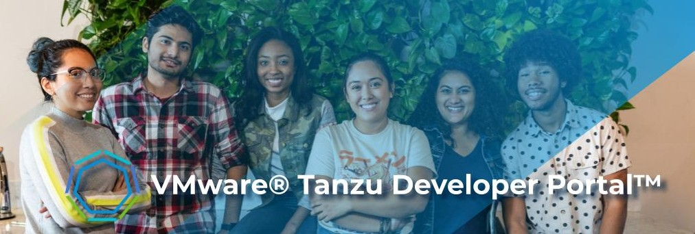

{ width="850" }

Your developers will love :heart: VMware® Tanzu Developer Portal™. VMware® Tanzu Developer Portal™ makes creating, discovering, and managing enterprise software faster and more productive for everyone! With VMware® Tanzu Developer Portal™, applications and APIs deployed across your business become easier to find, easier to understand, and easier to control. 

!!! tip "Proudly Based On [Backstage](https://backstage.io)"
    VMware® Tanzu Developer Portal™ is based on the open-source project ~[{ width="120" }](https://backstage.io)~ which began life as an internal developer portal at [Spotify engineering](https://engineering.atspotify.com/ "Spotify engineering").  Backstage enjoys a fast growing ecosystem of extensions called "[plugins](https://backstage.io/plugins/ "plugins")" that satisfy a broad range of developer requirements. Many leading platform vendors (including  VMware®) are contributing [source code](https://github.com/backstage "source code") to the Backstage project to ensure the developer experience is as rich and rewarding as possible.

Check out our [Getting Started Guide](./get-started.md) to quickly get up to speed with the VMware® Tanzu Developer Portal™ user interface. The [feature highlights](./features.md) of VMware® Tanzu Developer Portal™ include an enhanced developer experience and greater developer productivity. Take a look around to learn more.

## Where Can You Get VMware® Tanzu Developer Portal™?

VMware® Tanzu Developer Portal™ is available as a standalone license and as part of these VMware products:

???+ success "[VMware® Tanzu Application Platform™](https://via.vmw.com/tap)"
    VMware Tanzu Application Platform (based on [Kubernetes](https://kubernetes.io)) is a customizable, end-to-end solution that lets you build and deploy software more quickly and more securely - using a rich set of developer tools and a pre-paved "golden path" to production.

    [Learn More...](https://via.vmw.com/tap){ .md-button }

???+ success "[VMware® Tanzu Application Service™](https://via.vmw.com/tas)"
    VMware Tanzu Application Service (based on [CloudFoundry](https://www.cloudfoundry.org/)) is an opinionated application platform for enterprises that want to continuously build and run microservices across clouds.

    [Learn More...](https://via.vmw.com/tas){ .md-button }

 
