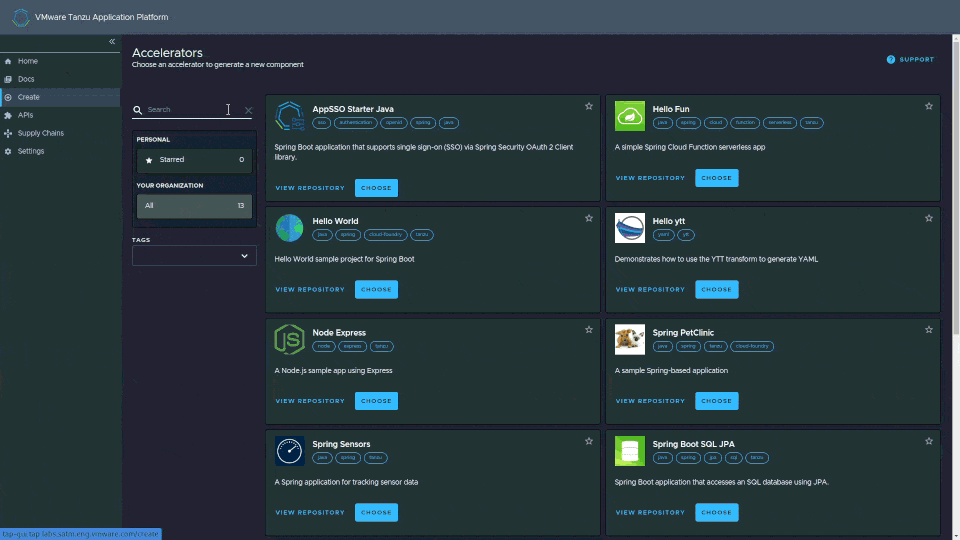

# Tanzu Developer Portal

The Tanzu Developer Portal is based on the open source [Backstage](https://backstage.spotify.com/) application first developed by Spotify.

## Open Source Backstage 

Backstage allows teams to document their applications in a number of ways:

* Software Catalogs (for documenting systems, components, teams, resources, etc.)
* API Docs (API documentation for OpenAPI, GRPC etc.)
* TechDocs (for rich documentation, how-to's, guides, etc.)
* Search (for easy discoverability of docs and details)

## Tanzu Developer Portal 

Tanzu Developer Portal includes the Backstage features listed above, but adds several additional features such as...

* [Application Accelerators](accelerators.md) (coding templates)
* Application Resource Viewer (K8s deployment details)
* Application Live View (runtime status)

The user interface of Tanzu Developer Portal will be instantly familiar to users of Backstage. Navigation is on the left, with subsequent pages being displayed in the middle. 

## Customizing The Tanzu Developer Portal

It is possible to replace the out-of-the-box branding with your own look and feel. See the [Tanzu Application Platform Documentation](https://docs.vmware.com/en/VMware-Tanzu-Application-Platform/index.html) for details.